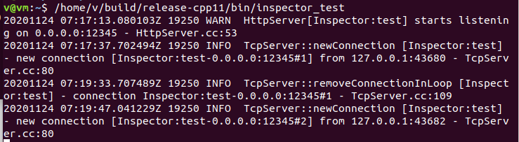
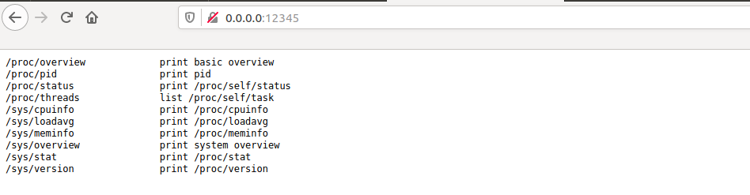
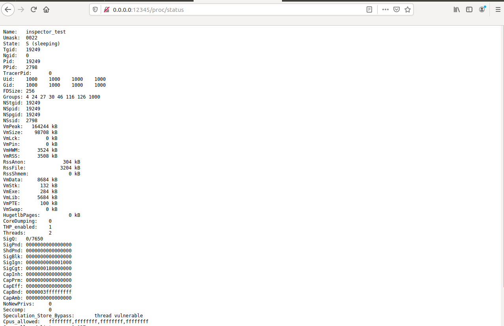
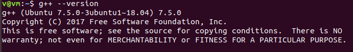

### 安装CMake

`sudo apt install cmake`

### 安装Boost

`sudo apt install libboost-dev libboost-test-dev`

### 安装非必须的依赖库(安装后cmake会自动多编译一些示例)

1. `sudo apt install libcur14-openssl-dev libc-ares-dev`
2. `sudo apt-get install protobuf-compiler libprotobuf-dev`

### git clone

`git clone https://github.com/chenshuo/muduo.git`

### 编译安装(默认Release版)

```bash
cd muduo
./build.sh -j2
./build.sh install
```

### 试运行案例

1. `/home/v/build/release-cpp11/bin/inspector_test`  
  
2. 通过浏览器访问0.0.0.0:12345  
  
3. 0.0.0.0:12345/proc/status  
  

****
g++版本  
