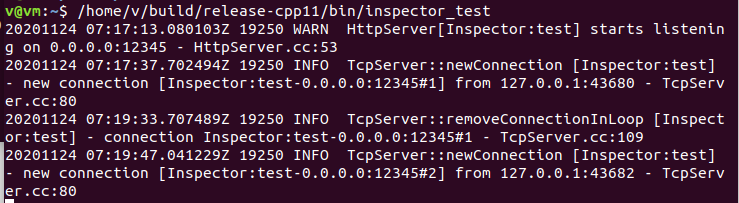
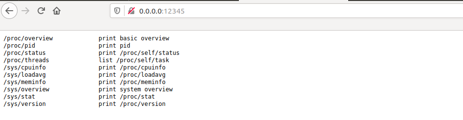
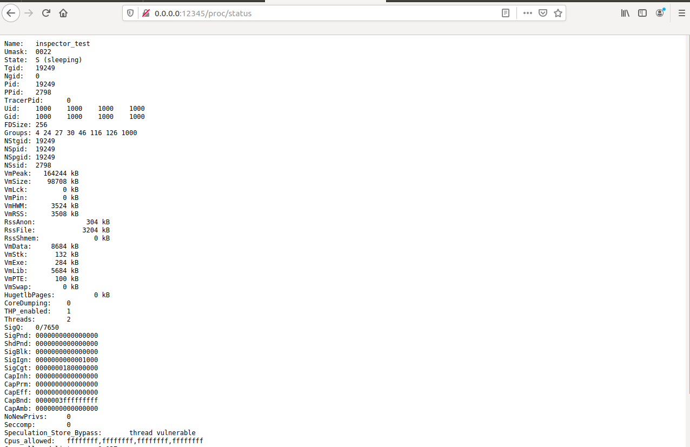
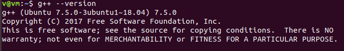
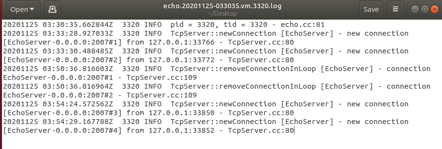

## 0 安装

### 0.1 安装CMake

`sudo apt install cmake`

### 0.2 安装Boost

`sudo apt install libboost-dev libboost-test-dev`

### 0.3 安装非必须的依赖库(安装后cmake会自动多编译一些示例)

1. `sudo apt install libcur14-openssl-dev libc-ares-dev`
2. `sudo apt-get install protobuf-compiler libprotobuf-dev`

### 0.4 git clone

`git clone https://github.com/chenshuo/muduo.git`

### 0.5 编译安装(默认Release版)

```bash
cd muduo
./build.sh -j2
./build.sh install
```

### 0.6 试运行案例

1. `/home/v/build/release-cpp11/bin/inspector_test`  
  
2. 通过浏览器访问0.0.0.0:12345  
  
3. 0.0.0.0:12345/proc/status  
  

为方便起见，将build目录整个移到muduo `mv -b build muduo`

****
### (备注)g++版本



## 1 使用

### 1.1 echo服务的实现

#### echo.cc

```cpp
#include "muduo/net/TcpServer.h"

#include "muduo/base/AsyncLogging.h"
#include "muduo/base/Logging.h"
#include "muduo/base/Thread.h"
#include "muduo/net/EventLoop.h"
#include "muduo/net/InetAddress.h"

#include <functional>
#include <utility>

#include <stdio.h>
#include <unistd.h>

using namespace muduo;
using namespace muduo::net;

class EchoServer
{
 public:
  EchoServer(EventLoop* loop, const InetAddress& listenAddr)
    : loop_(loop),
      server_(loop, listenAddr, "EchoServer")
  {
    server_.setConnectionCallback(
        std::bind(&EchoServer::onConnection, this, _1));
    server_.setMessageCallback(
        std::bind(&EchoServer::onMessage, this, _1, _2, _3));
  }

  void start()
  {
    server_.start();
  }

 private:
  void onConnection(const TcpConnectionPtr& conn);

  void onMessage(const TcpConnectionPtr& conn, Buffer* buf, Timestamp time);

  EventLoop* loop_;
  TcpServer server_;
};

void EchoServer::onConnection(const TcpConnectionPtr& conn)
{
  LOG_TRACE << conn->peerAddress().toIpPort() << " -> "
            << conn->localAddress().toIpPort() << " is "
            << (conn->connected() ? "UP" : "DOWN");
}

void EchoServer::onMessage(const TcpConnectionPtr& conn, Buffer* buf, Timestamp time)
{
  string msg(buf->retrieveAllAsString());
  LOG_TRACE << conn->name() << " recv " << msg.size() << " bytes at " << time.toString();
  conn->send(msg);
}

int kRollSize = 500*1000*1000;

std::unique_ptr<muduo::AsyncLogging> g_asyncLog;

void asyncOutput(const char* msg, int len)
{
  g_asyncLog->append(msg, len);
}

void setLogging(const char* argv0)
{
  muduo::Logger::setOutput(asyncOutput);
  char name[256];
  strncpy(name, argv0, 256);
  g_asyncLog.reset(new muduo::AsyncLogging(::basename(name), kRollSize));
  g_asyncLog->start();
}

int main(int argc, char* argv[])
{
  setLogging(argv[0]);

  LOG_INFO << "pid = " << getpid() << ", tid = " << CurrentThread::tid();
  EventLoop loop;
  InetAddress listenAddr(2007);
  EchoServer server(&loop, listenAddr);

  server.start();

  loop.loop();
}
```

#### 编译

[参考1](https://blog.csdn.net/PinkFriday/article/details/78523260)  
[参考2](https://blog.csdn.net/qq_34673519/article/details/97753784)  
[参考3](https://blog.csdn.net/u012997311/article/details/79288696)  
`g++ -o echo echo.cc -lmuduo_net -lmuduo_base -lpthread -I/home/v/muduo/build/release-install-cpp11/include/ -L/home/v/muduo/build/release-install-cpp11/lib/`

#### 效果

1. `./echo`  
2. 访问0.0.0.0:2007可以发现echo的日志有更新  
  